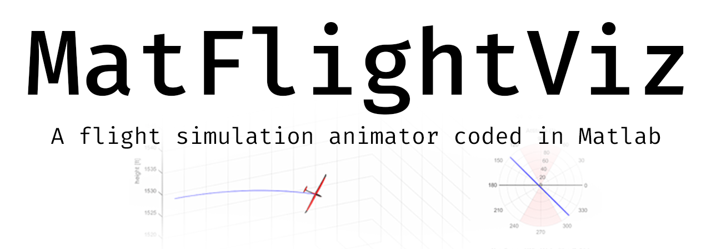
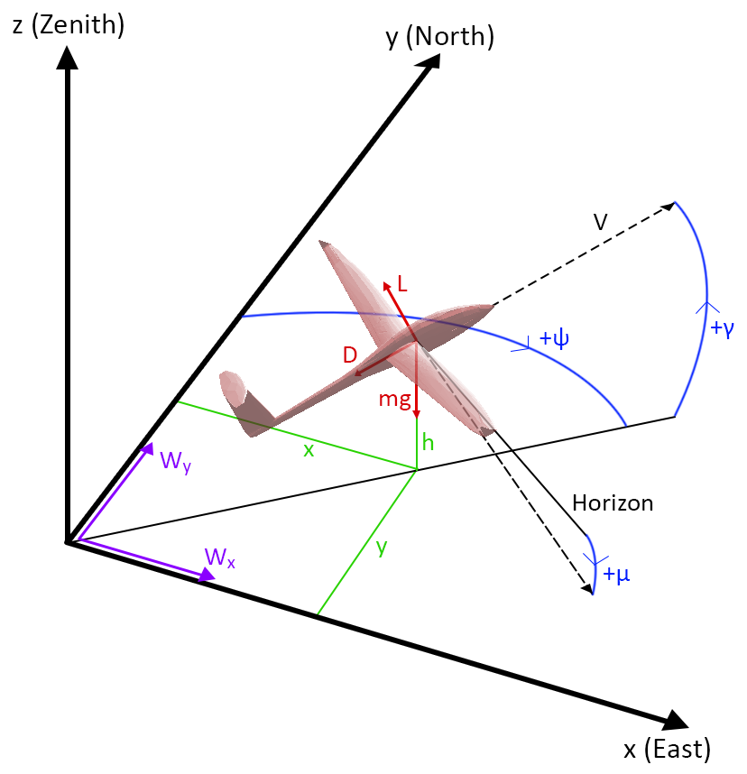

This is the project repository for a Matlab-based aircraft flight trajectory animator.

## Overview

File descriptions:
- animate.m: animates the trajectory to output a gif or avi
- interpolate.m: interpolates the trajectory input for improved control over framerates
- stlread.m: reads 3D STL file of aircraft model
- glider.stl: example STL model of small RC glider
- trajectory.mat: example flight simulation trajectory

## Getting started
To use the animator, users will need an STL model of the aircraft they want to animate, as well as a .mat file of the trajectory.

The following free-body diagram indicates the conventions of the states required to animate a trajectory:

The trajectory data is structured in separate arrays and values. They are described below.

### Arrays
All arrays have the same length.
- t_list: simulation time (seconds)
- x_list: vehicle's position along x-axis (East)
- y_list: vehicle's position along y-axis (North)
- h_list: altitude (ft)
- V_list: airspeed (ft/s)
- psi_list: heading angle (degrees). The heading angle should not roll over back to 0 after exceeding 360 degrees for ease of computation.
- gamma_list: pitch angle (radians)
- mu_list: roll angle (radians)
- Wx_list: x-axis component of the wind strength (ft/s)
- Wy_list: y-axis component of the wind strength (ft/s)

### Values
- dt: discrete time interval in seconds. For instance, dt=0.1 would mean that each subsequent value in a trajectory array was recorded 0.1s after the previous value.
- gamma_max: maximum allowable pitch angle in radians (used to scale the radius of the attitude miniplot)
- mu_max: maximum allowable roll angle (used to visualize the limits of the roll angle in the attitude plot)

## Creating the gif/avi
Simply follow the numbered comments in *animate.m*.
One particular section that requires explaining is the interpolation factor.
Users have the option to interpolate their trajectory (linearly) to achieve higher framerates.

For instance, if trajectory data was recorded at an interval of 0.1s (dt=0.1), the animation's framerate would have to be 1/dt=10 frames per second (fps) for a true-time visualization. Therefore, to achieve higher framerates, users can select an interpolation factor greater than 1 (factor of 1 will not result in any interpolation and will simply use the original trajectory data).

To calculate the desired framerate, use the following formula:
interp_factor = (desired framerate) * (dt)

For example, to create a 30fps animation with trajectory data recorded at 0.1s intervals, the interp_factor should be 3.0.

To further edit/crop the resulting gifs, use a [gif editor](https://ezgif.com/crop).
## Sample animation

